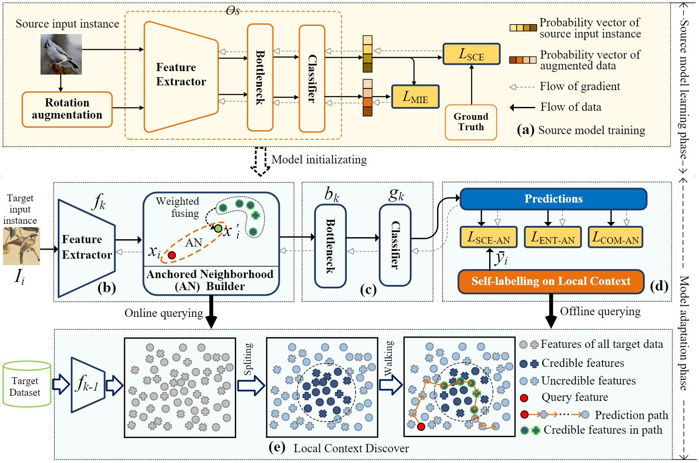
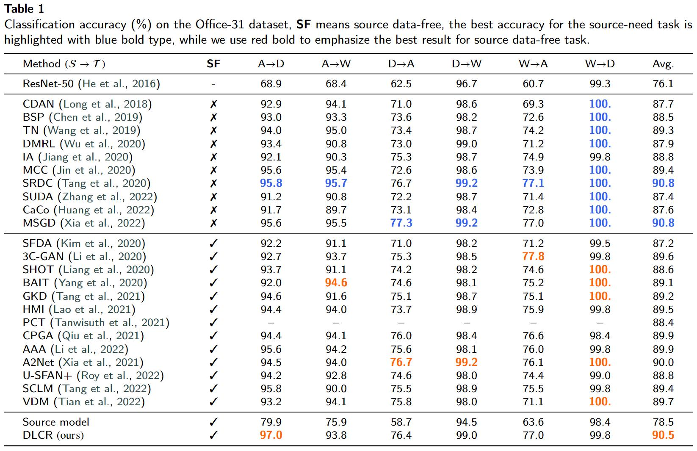

# Official implementation for [CLCR](CLCR: Source Data-free Domain Adaptation via Dynamic Local Context Representation)

Code (pytorch) for ['CLCR: Source Data-free Domain Adaptation via Dynamic Local Context Representation'] on Office-31, Office-Home, VisDA-C. This article is under review.

### Framework

### Datasets and Prerequisites

You need to download the [Office-31](https://drive.google.com/file/d/0B4IapRTv9pJ1WGZVd1VDMmhwdlE/view), [Office-Home](https://drive.google.com/file/d/0B81rNlvomiwed0V1YUxQdC1uOTg/view), [VisDA-C](https://github.com/VisionLearningGroup/taskcv-2017-public/tree/master/classification) dataset,  modify the path of images in each '.txt' under the folder './data_clcr/'.

The experiments are conducted on one GPU (NVIDIA RTX TITAN).

- python == 3.7.3
- pytorch ==1.6.0
- torchvision == 0.7.0

### Training and evaluation

1. Training Source modle. All the settings for different scenarios refers to **./run_source.sh**.

2. Then adapting source model to target domain, with only the unlabeled target data. All the settings for different methods and scenarios refers to **./run_targetr.sh**.

### Results

*The results of CLCR is display under the folder './results/'.*

### Acknowledgement

 [DeepCluster(ECCV 2018)](https://github.com/facebookresearch/deepcluster)'s work.

 [SHOT (ICML 2020, also source-free)](https://github.com/tim-learn/SHOT)'s work.

### Contact
- tntechlab@hotmail.com

